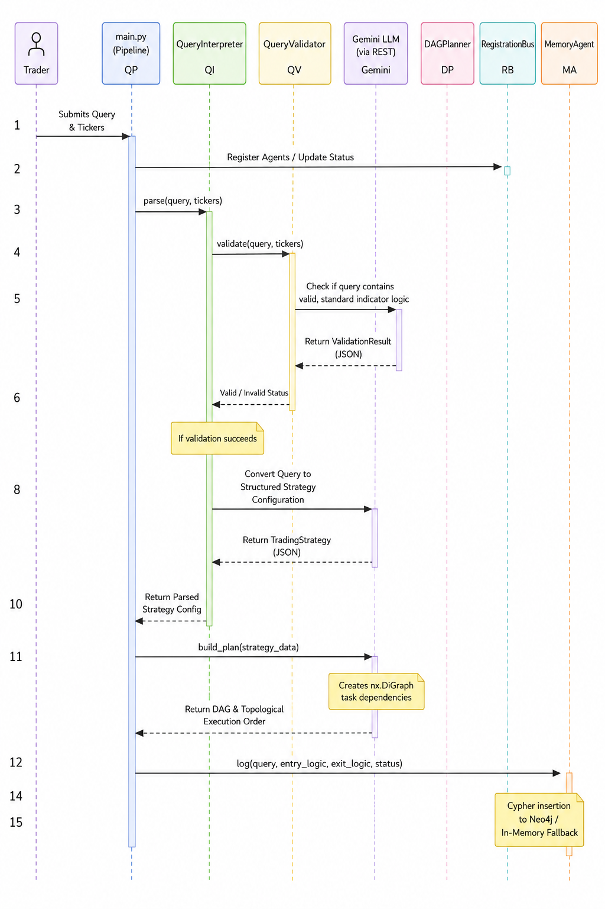
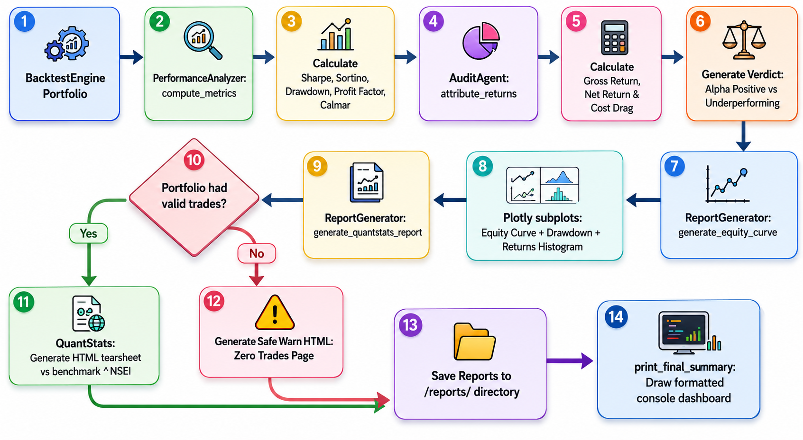

# 🤖 Backtesting Agent: Autonomous Quantitative Research Pipeline

## 1. Problem Statement
In quantitative finance, the gap between a **trading idea** (expressed in natural language) and a **validated backtest** (executable vectorized code) is significant. Traders often face:
- **Coding Barriers**: Implementing complex vectorized logic (like VectorBT) requires high technical proficiency.
- **Lookahead Bias**: Manual implementation often leads to "cheating" by using future data in entry signals.
- **Data Fragmentation**: Fetching, cleaning, and caching multi-market data is a repetitive and error-prone process.
- **Incomplete Analytics**: Many tools provide raw returns but fail to account for market-specific costs (STT, GST in India) or provide deep risk metrics like VaR and CVaR.

## 2. Objectives
The Backtesting Agent is designed to be an **autonomous quantitative researcher** that:
- **Bridges the Gap**: Converts plain English strategy descriptions into high-performance Python code.
- **Ensures Integrity**: Automatically applies lookahead-bias guards (shifts) and sanitizes code logic.
- **Automates Data**: Manages the end-to-end data lifecycle from fetching (YFinance) to local storage (DuckDB).
- **Professional Grade Analytics**: Generates institutional-level reports including interactive equity curves and factor attribution.

---

## 3. High-Level Architecture & Confidence Gatekeeper

The Backtesting Agent implements a modular, agentic structure governed by a **Confidence Scoring Framework** that acts as an Execution Gatekeeper Pipeline:

```
           [User Prompt]
                 │
                 ▼
     ┌───────────────────────┐
     │  Phase 1: Linguistic  │ < 0.70 ──► [Halt / Clarify parameters]
     └───────────────────────┘
                 │
                 ▼
     ┌───────────────────────┐
     │  Phase 2: Structural  │ < 0.70 ──► [AlphaAgent Auto-Retry (Max 3x)]
     └───────────────────────┘
                 │
                 ▼
     ┌───────────────────────┐
     │  Phase 3: Statistical │ ──► Calculates p-value & OOS Decay
     └───────────────────────┘
                 │
                 ▼
     ┌───────────────────────┐
     │   Gatekeeper Engine   │ ──► CCI = 0.2*L + 0.3*S + 0.5*Stat
     └───────────────────────┘
                 │
         ┌───────┼───────┐
         ▼               ▼
    [CCI >= 85%]   [70% <= CCI < 85%]   [CCI < 70%]
     🟢 Approved     🟡 Manual Audit     🔴 Rejected
```

The **Composite Confidence Index (CCI)** determines the deployment status:
- **CCI >= 85% (Approved)**: Strategy is approved for trading/paper trading.
- **70% <= CCI < 85% (Manual Audit)**: Strategy is put on hold for manual refinement.
- **CCI < 70% (Rejected)**: Halt execution and notify user of logical or security failure.

---

## 4. Deep-Dive Module Architecture

The system is split into **five main components** that execute sequentially under graph-based orchestration.

### 🧠 Module 1: NLP & Orchestration ("The Brain")
Responsible for parsing the trader's natural language input, validating indicators, constructing a Directed Acyclic Graph (DAG) for execution, and managing execution states.



#### Key Design Pillars:
- **Schema Integrity**: Uses `Pydantic` validation to force unstructured LLM outputs into typed, predictable structures (`TradingStrategyWithConfidence` schema) before compilation.
- **Graph-based Scheduling**: Employs `networkx` to build and sequence the execution tasks dynamically. Allows concurrent data fetches for multi-ticker strategies.
- **Linguistic Quality Gate**: Computes an intent score based on phrasing clarity and numerical completeness:
  $$\text{Intent Score} = 0.4 \times \text{Linguistic Confidence} + 0.6 \times \text{Numerical Completeness}$$
  If the score is $< 0.70$, execution is halted immediately.
- **Memory Tracing**: Logs execution runs to a **Neo4j** graph database, falling back gracefully to local memory list if connection fails.

---

### 📝 Module 2: Strategy Synthesis ("The Translator")
Translates structured strategy configuration parameters into executable Python statements tailored for the `VectorBT` framework.


#### Key Design Pillars:
- **AST Modification (Lookahead Guard)**: Uses Python's native `ast` compiler to parse generated code into Abstract Syntax Trees. It targets and transforms assignments to `entries` and `exits` variables, appending `.shift(1).fillna(False)` to guarantee lookahead-bias safety at a structural syntax level rather than relying on prompts.
- **Iterative Self-Healing**: Implements a compiler loop that executes syntactical validation using `compile()`. If syntax errors are caught, the traceback feedback is routed back to Gemini for up to 3 automated correction retries.
- **Security Sanitization**: The `CodeSanitizer` enforces a strict import allowlist (only allowing `pandas_ta`), normalizes dataframe column references to lowercase, and checks for malicious command keywords (`os`, `sys`, `eval`, etc.).
- **Skill Library**: Injects precise code templates for popular indicators (`RSI`, `SMA`, `EMA`, `MACD`, `BBANDS`, etc.) directly into the LLM system instructions to guide code generation.

---

### 💾 Module 3: Data & Market Connectivity ("The Heart")
Handles the end-to-end data lifecycle, caching, and market routing for stock and index queries.


#### Key Design Pillars:
- **OLAP Caching with DuckDB**: Integrates a local analytical DuckDB cache storing timezone-naive historical pricing. Columnar storage ensures zero-copy DataFrame integrations, yielding highly efficient reads/writes compared to row-based engines.
- **Warm-Up Padding**: Automatically fetches an extra 100 days of historical data prior to the requested start date. This ensures indicators requiring history (like EMAs) warm up fully, avoiding inaccurate signals at the start of backtests. The warm-up padding is sliced off before execution.
- **Market Adapters**: Resolves Indian equity suffixes (`.NS`/`.BO`) via the `OpenAlgoAgent` and fetches data through Yahoo Finance, handling cache invalidation if cached boundaries are stale (> 5 days) or incomplete.
- **Transaction Costs Adaptor**: The `IndianEquityAdaptor` provides localized modular structures to model STT, GST, stamp duty, and brokerage fees for delivery vs. intraday trades.

---

### ⚙️ Module 4: Execution & Portfolio Engine ("The Engine")
Sandboxes dynamic code compilation, standardizes execution data structures, and runs backtests.


#### Key Design Pillars:
- **Isolated Sandbox Execution**: Evaluates generated code inside a spawned child process (`multiprocessing` with a `"spawn"` method) with a strict 10-second timeout. This protects the orchestrator against infinite loops, memory leaks, or crashes in generated scripts.
- **Casing Tolerance**: Wraps DataFrames with `CaseInsensitiveDF` to intercept indexing operations and normalize column queries (supporting fuzzy and case-insensitive matching).
- **Tail Risk Analytics**: Incorporates `RiskAgent` which calculates historical Value-at-Risk (VaR) and Conditional Value-at-Risk (CVaR).
- **Leverage Constraint Gates**: Calculates position-sizing adjustments dynamically based on risk limits:
  $$\text{Leverage Factor} = \frac{\text{Maximum Acceptable VaR}}{\text{Strategy VaR}}$$
- **Signal Realignment**: Realigns and forces terminal signal exits on the final bar to prevent numba compilation hangs and ensure all positions are closed out.

---

### 📊 Module 5: Analytics & Audit ("The Eyes")
Performs post-backtest diagnostics, parses returns, and outputs both console dashboards and visual tearsheets.



#### Key Design Pillars:
- **KPI Analysis**: Computes Sharpe, Sortino, Calmar, profit factors, and maximum drawdowns. Employs downside deviation for Sortino calculations to avoid penalizing positive volatility.
- **Statistical Significance**: Evaluates p-values to verify strategy performance stability vs random chance, penalizing score cards if win rates show abnormal curve fitting (>95% or <10%).
- **Interactive Visualizations**: Generates dynamic, multi-plot Plotly charts displaying the equity curve, drawdown timeline, and daily return histograms.
- **Institutional Tearsheets**: Triggers `QuantStats` tearsheets comparing strategy returns against index benchmarks (`^NSEI`). Implements custom fallback error pages if the strategy generated zero trades, avoiding library crashes.

---

## 5. Unified End-to-End Workflow

The Backtesting Agent operates in five distinct pipeline steps:

1. **Intent Extraction & Verification (Phase 1)**: User submits query. `QueryInterpreter` structures intent and scores linguistic quality. If $<0.70$, execution halts.
2. **DAG Planning**: `DAGPlanner` generates task nodes and schedules data fetching tasks in topological execution order.
3. **Synthesis & AST Sanitization (Phase 2)**: `AlphaAgent` generates the VectorBT script. The sanitizer validates imports, rewrites code nodes to add lookahead shifts, and validates compilation. If verification fails, it retries up to 3 times.
4. **Isolated Execution**: `BacktestEngine` spawns a sandboxed process, runs the code, realigns signals, trims padding, and fires trade executions in VectorBT.
5. **Analytics & Global CCI Verdict (Phase 3)**: Performance analyzer computes statistical metrics (Sortino, Sharpe, p-value), generates HTML reports (Plotly + QuantStats), and prints the dashboard.

---

## 6. Technology Stack & Component Mapping

| Module Component | Technologies | Rationale |
| :--- | :--- | :--- |
| **Language Runtime** | Python 3.10+ | Standard environment for quantitative development. |
| **Orchestration & LLM** | Google Gemini (Gemini 2.5 Flash/Pro) | Advanced reasoning and strict Pydantic JSON schema compliance. |
| **Graph Planning** | NetworkX | Flexible topological task sorting and scheduling. |
| **Backtesting Core** | VectorBT | Extremely fast, Numba-compiled vectorized backtesting engine. |
| **Analytical Cache** | DuckDB | Columnar file database optimized for lightning-fast pandas integrations. |
| **Indicators Library** | Pandas-TA, TA-Lib | Comprehensive set of optimized technical indicator equations. |
| **Risk Metrics** | NumPy, SciPy (stats) | High-speed statistics for VaR, CVaR, and standard errors. |
| **Visualization & Reports**| Plotly, QuantStats | Rich, interactive HTML widgets and institutional statistical reports. |

---

## 7. Environment Configuration

The application requires configuration variables. Create a `.env` file in the project root:

```env
# Google Gemini Developer API Key
GEMINI_API_KEY=your_gemini_api_key_here
GEMINI_MODEL=gemini-2.5-flash-lite

# Optional: Neo4j Memory Agent Database
NEO4J_URI=bolt://localhost:7687
NEO4J_USER=neo4j
NEO4J_PASSWORD=your_neo4j_password

# System Defaults
DEFAULT_INIT_CASH=100000
DEFAULT_TIMEFRAME=1d
DEFAULT_MARKET=IN
```

---

## 8. Installation & Usage

### Setup
1. Clone the repository and navigate to the project directory.
2. Create a virtual environment and install packages:
   ```bash
   python -m venv venv
   venv\Scripts\activate
   pip install -r requirements.txt
   ```
3. Create a `.env` file based on the environment configuration section.

### Interactive Mode
Run the agent in an interactive loop:
```bash
python main.py
```
Type your query directly (e.g., *"Buy RELIANCE when RSI < 30, sell when RSI > 70 for the last 2 years"*).

### Command-Line Arguments Mode
Run a single query directly:
```bash
python main.py --query "Buy TCS when SMA 20 crosses above SMA 50 for the last 1 year" --market "IN"
```

---

## 9. Project Directory Tree

```
.
├── config.py             # Global configurations & env loader
├── main.py               # Application entry point & pipeline orchestrator
├── README.md             # Project documentation & architecture details
├── requirements.txt      # Project packages list
├── .env                  # Environment keys & defaults
├── cache/                # DuckDB analytical cache storage
│   └── trading_cache.db
├── reports/              # HTML charts & QuantStats output directory
└── modules/
    ├── __init__.py
    ├── nlp_orchestration.py   # Module 1: Parser, DAG and Neo4j
    ├── strategy_synthesis.py  # Module 2: Code compiler & AST sanitizer
    ├── data_connectivity.py   # Module 3: DuckDB caching & YFinance fetcher
    ├── execution_engine.py    # Module 4: Sandboxed VectorBT runner
    └── analytics_audit.py     # Module 5: KPI & plotly / tearsheet generator
```
