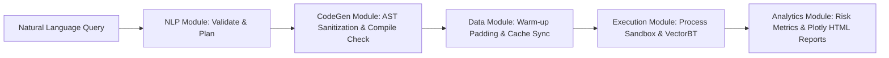

# 🤖 Backtesting Agent: Autonomous Quantitative Research Pipeline

<p align="center">
  
  
  
  
  
</p>

---

## 📈 Overview

The **Backtesting Agent** is an autonomous quantitative researcher that bridges the gap between natural language trading ideas and validated, lookahead-bias-safe backtests. By converting plain English strategy descriptions into high-performance Python code using VectorBT, the agent automates the end-to-end research workflow—from multi-market data ingestion and DuckDB caching to portfolio execution and institutional-grade risk analysis.

---

## 🧭 High-Level Execution Gatekeeper

The pipeline is managed by a **Confidence Scoring Framework** that enforces strict gates before any strategy is executed or approved:

```
           [User Prompt]
                 │
                 ▼
     ┌───────────────────────┐
     │  Phase 1: Linguistic  │ < 0.70 ──► [Halt / Clarify parameters]
     └───────────────────────┘
                 │
                 ▼
     ┌───────────────────────┐
     │  Phase 2: Structural  │ < 0.70 ──► [AlphaAgent Auto-Retry (Max 3x)]
     └───────────────────────┘
                 │
                 ▼
     ┌───────────────────────┐
     │  Phase 3: Statistical │ ──► Calculates Sharpe p-value
     └───────────────────────┘
                 │
                 ▼
     ┌───────────────────────┐
     │   Gatekeeper Engine   │ ──► CCI = 0.2*L + 0.3*S + 0.5*Stat
     └───────────────────────┘
                 │
         ┌───────┼───────┐
         ▼               ▼
    [CCI >= 85%]   [70% <= CCI < 85%]   [CCI < 70%]
     🟢 Approved     🟡 Manual Audit     🔴 Rejected
```

> [!NOTE]
> The **Composite Confidence Index (CCI)** acts as the deployment routing gate:
> - **🟢 Approved (CCI >= 85%)**: Automatically verified and scaled to 100% capital allocation.
> - **🟡 Manual Audit (70% <= CCI < 85%)**: Strategy held for user intervention to fix phrasing or parameters.
> - **🔴 Rejected (CCI < 70%)**: Halted immediately to prevent execution of invalid logic or security violations.

---

## 🏗️ Detailed Architecture & Component Pillars

The system is structured as five sequential, graph-orchestrated modules.

### 🧠 Module 1: NLP & Orchestration ("The Brain")

Processes raw queries, validates symbols, schedules execution nodes, and persists session states.

<p align="center">
  
</p>

#### Core Pillars:
- **Linguistic Quality Gate**: Calculates a weighted score checking phrasing clarity and numerical indicator completeness:
  $$\text{Intent Score} = 0.4 \times \text{Linguistic Confidence} + 0.6 \times \text{Numerical Completeness}$$
- **Index Recognition & Macro Resolution**: Targets index strategies (e.g. "Nifty 50") as standard index macros (`["nifty50"]`) in the parser instead of static symbol expansion, deferring member lookup to the data connectivity router.
- **DAG Scheduling**: Constructs dynamic execution plans using `networkx` to run concurrent tasks (like data fetching) in parallel.
- **Schema Enforcement**: Employs `Pydantic` structures (`TradingStrategyWithConfidence`) to prevent model hallucination drift.
- **State Persistence**: Records execution paths in a **Neo4j** graph database, utilizing a thread-safe local memory fallback if offline.

---

### 📝 Module 2: Strategy Synthesis ("The Translator")

Translates natural language intentions into clean, vectorized Python code compliant with VectorBT.

<p align="center">
  
</p>

#### Core Pillars:
- **AST Transformation (Lookahead Guard)**: Uses Python's native `ast` compiler to rewrite the generated source tree, automatically appending `.shift(1).fillna(False)` to `entries` and `exits` assignments to prevent lookahead bias.
- **Self-Correction Compiler**: Runs `compile()` inside validation wrappers. If syntax errors occur, the traceback is piped back to Gemini for up to 3 automated self-healing retries.
- **Strict Code Sanitization**: The `CodeSanitizer` enforces an import whitelist (`pandas_ta`), maps indicator string casing, and rejects blacklisted system functions (`os`, `sys`, `eval`, etc.).
- **Predefined Skill Library**: Pre-loads modular templates for major indicators (`RSI`, `SMA`, `EMA`, `MACD`, `BBANDS`, `STOCH`, `ATR`) to guide code precision.

---

### 💾 Module 3: Data & Market Connectivity ("The Heart")

Manages market adapters, cache synchronization, and transaction costs modeling.

<p align="center">
  
</p>

#### Core Pillars:
- **DuckDB OLAP Cache**: Caches historical market rates using an embedded columnar DuckDB database for instant, zero-copy conversion into Pandas DataFrames.
- **Dynamic Constituent Tracker**: Features a cached mapping table (`historical_index_map`) to store and query historical constituent membership intervals.
- **Warm-Up Padding**: Fetches an extra 100 days of historical records prior to the target start date to avoid indicator warm-up distortion, trimming it prior to evaluation.
- **Adapters & Routing**: Employs `OpenAlgoAgent` to handle Indian stock tickers (mapping to `.NS` or `.BO` automatically) and fetches via Yahoo Finance.
- **Cost Attributors**: Integrates the `IndianEquityAdaptor` to provide hook-points for Indian market fee structures (STT, stamp duty, GST, and broker commissions).

---

### ⚙️ Module 4: Execution & Portfolio Engine ("The Engine")

Runs the synthesized code safely in sandbox processes and processes signal evaluations.

<p align="center">
  
</p>

#### Core Pillars:
- **Process Sandboxing**: Spawns executions in separate child processes with a strict 10-second timeout, protecting the main thread from infinite loops or memory leaks.
- **Point-in-Time (PIT) Universe Gating**: Applies the constituent mask matrix to restrict trade entries to active index member days and trigger mandatory liquidations on removal dates.
- **Casing & Proxy Wrappers**: Uses `CaseInsensitiveDF` and `PandasTAProxy` to dynamically catch and resolve case mismatches (e.g. `close` vs `Close`, `MACD_12_26_9` vs `macd_12_26_9`).
- **Leverage Sizing Adjuster**: Uses the `RiskAgent` to calculate Value-at-Risk (VaR) and Conditional Value-at-Risk (CVaR). If VaR exceeds limits (default: -2.0% daily), it dynamically scales down the strategy leverage:
  $$\text{Leverage Factor} = \frac{\text{Maximum Acceptable VaR}}{\text{Strategy VaR}}$$

---

### 📊 Module 5: Analytics & Audit ("The Eyes")

Runs statistics, evaluates transaction costs drag, and generates interactive reports.

<p align="center">
  
</p>

#### Core Pillars:
- **Constituent-Aligned Analysis**: Aligns portfolio returns with the stock's active index periods to calculate precise diagnostics (like zero-return diagnostics) without skewing idle-period indicators.
- **KPI Matrix**: Calculates Sharpe, Sortino, Calmar, profit factor, and drawdowns. Sortino computation adjusts standard errors for single-day negative variances to avoid division-by-zero crashes.
- **Statistical P-Value Gate**: Computes the Sharpe standard error and statistical p-value to reject luck:
  $$\text{Sharpe Error} = \sqrt{\frac{1 + \frac{\text{Sharpe}^2}{2}}{N_{\text{days}}}}$$
  $$\text{T-Stat} = \frac{\text{Sharpe}}{\text{Sharpe Error}}$$
- **Dual Visualization Engine**: Generates interactive HTML Plotly dashboards (Equity curve, Drawdowns, and returns distributions) along with QuantStats Tearsheets comparing returns against the Nifty 50 index (`^NSEI`).
- **Attribution Audit**: Calculates gross returns, net returns, and fee drags:
  $$\text{Cost Drag} = \frac{\text{Total Transaction Fees}}{\text{Initial Cash}}$$
  Flags warnings if costs consume $> 50\%$ of the gross strategy return.

---

## ⏰ Point-in-Time (PIT) Universe Gating & Historical Resolution

Real-world equity indices undergo periodic reconstitution. Testing strategies using the *current* list of index members introduces **survivorship bias** (since failed/delisted companies are excluded) and **lookahead bias** (since they weren't in the index in past years). 

The Backtesting Agent implements a robust **Point-in-Time (PIT) Universe Gating** flow to solve this:

<p align="center">
  
</p>

1. **Constituent Tracking Table (`historical_index_map`)**: A cache database table storing index names, constituent ticker symbols, and their valid start and end dates.
2. **Dynamic Constituent Resolution**: If the interpreter detects an index macro (e.g., `"nifty50"`), the downstream `DataRouter` queries the DuckDB cache to find the active constituents over the backtest timeframe, resolving and downloading them dynamically.
3. **Execution Gating & Mandatory Liquidation**: During strategy simulation, a daily-aligned universe mask is applied to the backtesting logic:
   - **Entry Block**: Entry signals are blocked if a ticker is not an active constituent on the trading day.
   - **Forced Exit**: A position is mandatorily liquidated on the exact day it is removed from the index universe.

<p align="center">
  
</p>

---

## 🔄 End-to-End Pipeline Execution



1. **Phase 1 Validation**: `QueryInterpreter` checks intent and parses tickers (normalizes index macros).
2. **Task Graphing**: `DAGPlanner` maps dependencies and runs data routing.
3. **Phase 2 Sanitization**: `AlphaAgent` codes the rules, applying AST lookahead guards and compile-checking the code.
4. **Sandboxed Testing**: `BacktestEngine` runs the simulation under PIT universe gating constraints, trims padding, and calculates VaR.
5. **Phase 3 Statistics & Dashboarding**: `PerformanceAnalyzer` scores statistical viability aligned with constituent active periods, exports HTML logs, and prints the summary.

---

## 🛠️ Technology Stack & Mapping

| Component | Technology | Rationale |
| :--- | :--- | :--- |
| **Orchestrator** | Python 3.10+ | Robust support for quantitative analysis libraries. |
| **LLM Reasoning** | Google Gemini | Fast generation speeds with native Pydantic schema validation. |
| **Dependency Graphs** | NetworkX | Simple DAG scheduling and topological task sorting. |
| **Vector Engine** | VectorBT | Incredibly fast vectorized matrix simulations built with Numba. |
| **Analytical Cache** | DuckDB | Embeddable OLAP database with zero-copy Pandas integration and table constraints. |
| **Technical Math** | NumPy & SciPy | High-performance linear algebra and statistical calculators. |
| **Report Cards** | QuantStats & Plotly | Polished tearsheets and interactive visual dashboards. |

---

## ⚙️ Configuration & Setup

### 1. Environment Config
Create a `.env` file in the project root:
```env
# API Configuration
GEMINI_API_KEY=your_gemini_api_key_here
GEMINI_MODEL=gemini-2.5-flash-lite

# Optional Graph Database
NEO4J_URI=bolt://localhost:7687
NEO4J_USER=neo4j
NEO4J_PASSWORD=your_neo4j_password

# Configuration Defaults
DEFAULT_INIT_CASH=100000
DEFAULT_TIMEFRAME=1d
DEFAULT_MARKET=IN
```

### 2. Installation & Database Seeding
```bash
# Clone the repository
git clone https://github.com/A-RYAN-KR/Backtesting-Agent.git
cd Backtesting-Agent

# Setup virtual environment
python -m venv venv
source venv/bin/activate  # On Windows use: venv\Scripts\activate

# Install dependencies
pip install -r requirements.txt

# Seed the historical index cache (DuckDB database setup)
python seed_db.py
```

---

## 🚀 Usage Guide

### Interactive CLI Loop
Run the interactive console to test queries sequentially:
```bash
python main.py
```
> **Example prompt:** *"Buy Nifty 50 when RSI < 30, sell when RSI > 70 for the last 2 years"*
> *(Note: The engine will dynamically resolve Nifty 50 constituents and apply Point-in-Time universe gating)*

### Single-shot Mode
Run a query immediately from the terminal:
```bash
python main.py --query "Buy TCS when SMA 20 crosses above SMA 50 for the last 1 year" --market "IN"
```

---

## 📂 Repository Structure

<details>
<summary><b>Click to expand project directory tree</b></summary>

```
.
├── config.py                 # Configuration loader & defaults
├── main.py                   # Unified pipeline runner & CLI entrypoint
├── README.md                 # Aesthetic documentation & system blueprints
├── requirements.txt          # Required package list
├── .env                      # Secrets configuration
├── nifty50_historical_seed.csv # CSV tracking historical Nifty 50 member timelines
├── seed_db.py                # Database seeder for historical index mapping
├── cache/                    # DuckDB analytical cache database directory
│   └── trading_cache.db
├── reports/                  # Target directory for exported Plotly & Tearsheets
└── docs/                     # Visual assets & detailed module blueprints
    ├── assets/               # PNG diagrams & architectural flowcharts
    ├── nlp_orchestration.md  # Module 1 detailed blueprint
    ├── strategy_synthesis.md # Module 2 detailed blueprint
    ├── data_connectivity.md  # Module 3 detailed blueprint
    ├── execution_engine.md   # Module 4 detailed blueprint
    └── analytics_audit.md    # Module 5 detailed blueprint
```
</details>
