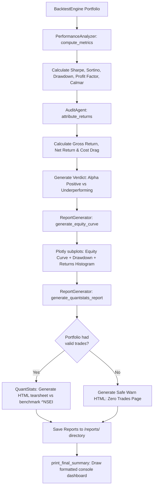

# Module 5: Analytics & Audit ("The Eyes")

The `analytics_audit.py` module is the reporting and diagnostics engine of the Backtesting Agent. It calculates risk-adjusted performance metrics, attributes returns to strategy alpha vs transaction costs, and generates interactive HTML reports and tearsheets.

---

## 1. Low-Level Design (LLD)

### Analytics Calculation & Visual Reporting Flow
The module processes return streams from VectorBT portfolios, calculates risk metrics, and generates visual reports:



### Key Design Pillars
1. **Mathematical Robustness**: Financial metrics can yield division-by-zero or `NaN` errors when backtesting quiet periods or strategies with very few trades. The analytics module implements mathematical fallbacks (e.g. sample size adjustments for downside deviation) to ensure calculation stability.
2. **Attribution Auditing**: Evaluates strategy performance relative to trading costs. If high transaction frequency or fees consume more than 50% of profits, the system flags the issue to warn the trader.
3. **Dual Visualizations**: Combines detailed Plotly time-series subplots (for interactive analysis) with QuantStats tearsheets (for institutional-grade statistical analysis).

---

## 2. Component and Class Breakdown

### Performance Calculations

```
┌────────────────────────────────────────────────────────┐
│                   analytics_audit.py                   │
├───────────────────┬───────────────────┬────────────────┤
│PerformanceAnalyzer│    AuditAgent     │ReportGenerator │
├───────────────────┼───────────────────┼────────────────┤
│ Calculates Sharpe,│ Decomposes returns│ Generates charts│
│ Sortino, Calmar   │ gross vs net/fees │ and tearsheets │
└───────────────────┴───────────────────┴────────────────┘
```

#### `PerformanceAnalyzer`
* **Role**: Computes key performance indicators (KPIs) and statistical confidence metrics from the backtest results.
* **Calculations**:
  - **Annualized Sharpe Ratio**:
    $$\text{Sharpe} = \frac{\mu_{\text{daily}}}{\sigma_{\text{daily}}} \times \sqrt{252}$$
    *Where $\mu$ is the mean daily return, and $\sigma$ is the daily standard deviation. If standard deviation is zero, Sharpe defaults to `0.0`.*
  - **Annualized Sortino Ratio**:
    $$\text{Sortino} = \frac{\mu_{\text{daily}}}{\sigma_{\text{downside}}} \times \sqrt{252}$$
    *Where $\sigma_{\text{downside}}$ is the standard deviation of negative returns. The module handles small sample sizes: if only 1 negative return day exists, it calculates the standard deviation using `ddof=0` (population standard deviation) instead of `ddof=1` (sample standard deviation) to prevent `NaN` errors.*
  - **Max Drawdown**: Calculates the maximum peak-to-trough decline.
    $$\text{Drawdown}_t = \frac{\text{Equity}_t - \text{Peak}_t}{\text{Peak}_t}$$
  - **Calmar Ratio**:
    $$\text{Calmar} = \frac{\text{Annualized Return}}{|\text{Max Drawdown}|}$$
  - **Profit Factor**:
    $$\text{Profit Factor} = \frac{\sum \text{Positive Returns}}{\sum |\text{Negative Returns}|}$$
    *If total losses are zero, it returns infinity (`inf`).*
  - **Statistical P-Value (Phase 3 Score)**:
    - Calculates the standard error of the Sharpe ratio: `sharpe_error = np.sqrt((1 + (sharpe ** 2) / 2) / n_days)`.
    - Derives the T-statistic: `t_stat = sharpe / sharpe_error`.
    - Computes the statistical p-value: `p_value = 1 - stats.norm.cdf(t_stat)`.
    - Assigns statistical score: `phase_3_score = 1.0 - p_value`.
    - Penalizes `phase_3_score` by `50%` if win rate is absurdly high (>95%) or low (<10%).
  - **Out-of-Sample (OOS) Decay**:
    - Splits the backtest returns 70/30 into In-Sample (IS) and Out-of-Sample (OOS).
    - Measures the decay ratio: `oos_sharpe / is_sharpe`.
    - Penalizes `phase_3_score` by `30%` if the decay ratio is less than `0.10` or if the OOS return drops to negative, indicating high risk of curve-fitting.
* **Methods**:
  - `compute_metrics(portfolio) -> dict`: Extracts the return series from a VectorBT portfolio, performs calculations, and returns a dictionary of metrics including Phase 3 scores.

---

### Strategy Audits

#### `AuditAgent`
* **Role**: Attributes strategy returns to performance and cost factors.
* **Calculations**:
  - **Cost Drag**:
    $$\text{Cost Drag} = \frac{\text{Total Transaction Fees}}{\text{Initial Cash}}$$
  - **Gross Return**:
    $$\text{Gross Return} = \text{Net Return} + \text{Cost Drag}$$
  - **Risk-Adjusted Return**:
    $$\text{Risk-Adjusted Return} = \frac{\text{Net Return}}{|\text{Value-at-Risk}|}$$
* **Methods**:
  - `attribute_returns(backtest_result: dict) -> dict`: Calculates the performance metrics above. If the total fees consumed exceed 50% of gross profits, it flags a warning: `WARNING: Fees consume >50% of gross return!`. It returns a verdict based on performance (positive vs negative net returns).

---

### Visualization and Reporting

#### `ReportGenerator`
* **Role**: Generates visual HTML reports.
* **Methods**:
  - `generate_equity_curve(portfolio, ticker: str, metrics: dict) -> go.Figure`: Creates an interactive Plotly chart containing three subplots:
    1. **Equity Curve (Subplot 1)**: Visualizes portfolio growth over time.
    2. **Drawdown Chart (Subplot 2)**: Displays peak-to-trough drawdowns.
    3. **Returns Histogram (Subplot 3)**: Renders the distribution of daily returns.
  - `generate_quantstats_report(portfolio, ticker: str, benchmark_ticker: str) -> str | None`: Generates a QuantStats HTML report comparing returns against a benchmark (default: Nifty 50 `^NSEI`).
    * **Flat-equity Fallback**: If no trades are executed, generating a tearsheet can crash the application. To handle this case, the engine intercepts flat return vectors and generates a standard warning HTML page (`{Ticker}_quantstats.html`) explaining that no trade signals were triggered.
  - `generate_full_report(backtest_results: dict, strategy_info: dict) -> dict`: Compiles performance metrics, returns attribution, Plotly charts, and tearsheets for all backtested symbols.

---

### Dashboard Printing

#### `print_final_summary(report: dict)`
* **Role**: Outputs a formatted dashboard containing strategy parameters, returns, Sharpe ratios, drawdowns, transaction costs, and tearsheet locations directly to the console.

---

## 3. Design Decisions & Trade-offs (The "Why")

### Why use downside deviation instead of standard deviation for Sortino calculations?
The Sharpe ratio penalizes upside volatility (large positive returns) and downside volatility equally. However, traders welcome upside volatility. 
The Sortino ratio uses downside deviation ($\sigma_{\text{downside}}$), which only penalizes volatility below zero. This provides a more accurate representation of risk-adjusted returns for strategies with asymmetrical return profiles (e.g., long-volatility options strategies).

### Why use Plotly instead of Matplotlib for equity curves?
Matplotlib generates static raster images (e.g. PNG, JPEG). These charts cannot be scaled or inspected interactively. 
Plotly outputs vector-based, interactive HTML widgets. This allows traders to zoom in on specific drawdowns, hover over datapoints to inspect execution values, and view metrics dynamically in their web browser.

### Why implement a custom warning page fallback for QuantStats?
If a strategy generated no signals (e.g., if entry conditions were never met), the return vector will contain only zeroes. Under these conditions, the QuantStats library will throw a `ZeroDivisionError` or generate a blank report when trying to compute return ratios.
Intercepting this condition and rendering a custom warning HTML page explaining why no signals were triggered prevents the application from crashing and provides the trader with helpful feedback.
