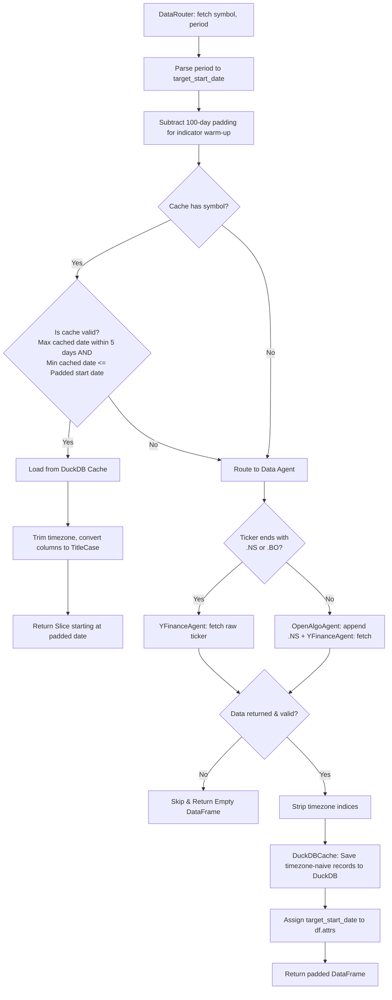

# Module 3: Data & Market Connectivity ("The Heart")

The `data_connectivity.py` module manages the data storage and ingestion lifecycle of the Backtesting Agent. It is responsible for fetching OHLCV historical pricing data, validating the schemas, caching data locally to avoid API rate limits, and preparing pricing data for backtesting.

---

## 1. Low-Level Design (LLD)

### Data Fetching and Caching Lifecycles
The module handles local database reads, API requests, and data validation. Below is a diagram showing how a fetch request is routed and cached:



### Key Design Pillars
1. **Padded Indicator Warm-up**: Technical indicators (especially Exponential Moving Averages, MACD, and RSI) rely on decay functions or lookback windows. If a strategy backtest starts on day 0, the first few indicator records will be `NaN` or mathematically inaccurate. To address this, the data layer fetches an extra 100 days of history, passes the padded data to the indicator compiler, and then trims the padding before evaluation.
2. **DuckDB OLAP Cache**: Rather than using slower JSON, CSV, or SQLite files, the system uses `DuckDB`. As a columnar database, DuckDB is optimized for analytical queries and pandas integrations, returning results directly as DataFrames.
3. **Graceful Cache Invalidation**: The cache validates both the start date and end date to prevent gaps. If a trader requests a larger historical range than what is cached, or if the cached data is more than 5 days old, the system automatically triggers a fresh download and updates the cache.
4. **Point-in-Time Index Constituent Resolution**: Real-world indexes (like the Nifty 50) reconstitute periodically (e.g., adding or removing stocks). Performing backtests on the *current* list of index members introduces survivorship bias. The connectivity module incorporates a dynamic historical mapping system that queries the historical index records to resolve the active constituents for the requested period.

---

## 2. Component and Class Breakdown

### Cache Management

```
┌────────────────────────────────────────────────────────┐
│                  data_connectivity.py                  │
├───────────────────┬───────────────────┬────────────────┤
│   DuckDBCache     │ IndianEquityAdaptor│   DataRouter   │
├───────────────────┼───────────────────┼────────────────┤
│ DuckDB analytical │ Transaction cost  │ Resolves routes│
│ cache database    │ modeling stub     │ and invalidation│
└───────────────────┴───────────────────┴────────────────┘
```

#### `DuckDBCache`
* **Role**: Integrates the database cache with pandas.
* **Attributes**:
  - `db_path`: Filepath to the DuckDB database (default: `/cache/trading_cache.db`).
  - `conn`: DuckDB connection instance.
* **Methods**:
  - `__init__(db_path: str)`: Connects to the database and initializes:
    1. The `ohlcv_data` table with a `UNIQUE(symbol, timestamp)` index to prevent duplicate records.
    2. The `historical_index_map` table with schema `(index_name VARCHAR, symbol VARCHAR, start_date TIMESTAMP, end_date TIMESTAMP)` and a `UNIQUE(index_name, symbol, start_date)` index to track historical index constituency changes.
  - `save(df: pd.DataFrame, symbol: str, source: str)`: Cleans and standardizes the DataFrame:
    1. Extracts or constructs the timestamp index.
    2. Strips timezones (`tz_localize(None)`) to maintain database compatibility.
    3. Maps keys to lowercase (`open`, `high`, `low`, `close`, `volume`).
    4. Registers the temporary pandas DataFrame directly inside the DuckDB session and inserts records using an `INSERT OR IGNORE` statement to handle duplicate keys.
  - `load(symbol: str) -> pd.DataFrame`: Retrieves the sorted historical data for a symbol. It maps database columns back to Title Case (`Open`, `High`, `Low`, `Close`, `Volume`) before returning to match standard pandas conventions.
  - `has_data(symbol: str) -> bool`: Verifies if records exist for a symbol.
  - `get_cache_range(symbol: str) -> tuple`: Returns the `(min_timestamp, max_timestamp)` for a cached symbol to check historical coverage.
  - `get_historical_universe_mask(index_name: str, pricing_index: pd.DatetimeIndex) -> pd.DataFrame`: Queries the `historical_index_map` table and returns a trading-day-aligned boolean mask matrix showing which stocks were active constituents of the specified index at each timestamp in `pricing_index`.

---

### Cost Modeling

#### `IndianEquityAdaptor`
* **Role**: Models transaction costs (brokerage, STT, GST, stamp duty) for Indian equity markets.
* **Methods**:
  - `calculate_costs(trade_value: float, qty: int, is_buy: bool) -> dict`: Returns a breakdown of trading costs. Currently return zeroes, serving as an extension hook for custom cost structures.

---

### Data Ingestion and Routing

#### `YFinanceAgent`
* **Role**: Ingests market data from Yahoo Finance.
* **Methods**:
  - `fetch(symbol: str, period: str, interval: str, start) -> pd.DataFrame`: Queries Yahoo Finance via `yfinance`. It cleans the returned DataFrame, strips timezone labels from the datetime index, and returns the result.

#### `OpenAlgoAgent`
* **Role**: Resolves tickers for the Indian markets.
* **Methods**:
  - `fetch(symbol: str, period: str, interval: str, start) -> pd.DataFrame`: Checks if the symbol ends with `.NS` or `.BO`. If not, it appends `.NS` (National Stock Exchange of India suffix) and routes the request to `YFinanceAgent`.

#### `DataRouter`
* **Role**: Orchestrates data loading, caching, and validation.
* **Methods**:
  - `fetch(symbol: str, period: str, market: str) -> pd.DataFrame`:
    1. Parses the period string (e.g. "1y") to a start date.
    2. Calculates a 100-day padded start date.
    3. Queries `DuckDBCache` for existing records.
    4. Verifies if the cache covers the padded range and is not stale (older than 5 days).
    5. If valid, loads from the cache, slices the index to match the padded start date, and returns.
    6. If invalid, downloads the data from the appropriate agent, saves it to the cache, and attaches `target_start_date` to the DataFrame's metadata (`df.attrs`).
  - `fetch_multiple(symbols: list, period: str, market: str) -> dict`: Fetches data for multiple symbols. It performs dynamic **Point-in-Time Index constituent resolution**:
    1. Intercepts any index macro (e.g., `"nifty50"`).
    2. Resolves historical constituents for the given backtest period by querying the `historical_index_map` cache table in DuckDB.
    3. Merges and deduplicates resolved constituent tickers with other explicit symbols.
    4. Fetches market data for each ticker (from cache or via the data agents).
    5. Stamping context: If a ticker was resolved as an active constituent of an index, it stamps the DataFrame's metadata `df.attrs["index_context"] = "nifty50"`.
    6. Filters and returns a dictionary of `symbol -> DataFrame`, validating that all required OHLCV columns exist and gracefully skipping tickers with missing or invalid data.

---

## 3. Design Decisions & Trade-offs (The "Why")

### Why DuckDB instead of SQLite?
Quantitative backtesting relies heavily on pandas DataFrame structures. Standard SQL databases like SQLite store data in a row-based format, which requires unpacking rows into memory when converting query results to pandas DataFrames. 
DuckDB is a columnar, analytical database (OLAP) written specifically for vector operations and pandas integration. It registers pandas DataFrames in-memory without data duplication and exports query results directly as native DataFrames, providing a significant performance advantage for financial time-series data.

### Why tz-naive timestamps inside the DuckDB cache?
Datetime structures with timezone offsets (e.g. `UTC+05:30`) frequently cause compatibility issues during database integration and pandas slice operations. 
By stripping timezone information (`tz_localize(None)`) before writing to the cache, the system stores timestamps in a standard, consistent format.

### Why keep transaction cost stubs in `IndianEquityAdaptor`?
Calculating transaction costs in Indian markets involves complex fee calculations based on trade type (e.g. intraday vs delivery):
- **STT (Securities Transaction Tax)**: 0.1% on purchase and sale for Delivery, but only 0.025% on sale for Intraday.
- **Stamp Duty**: 0.015% on purchase for Delivery, 0.003% for Intraday.
- **GST**: 18% applied to the sum of brokerage and exchange transaction charges.
Keeping these calculations isolated inside the `IndianEquityAdaptor` class allows us to implement complex tax structures without cluttering the core execution and backtesting code.
