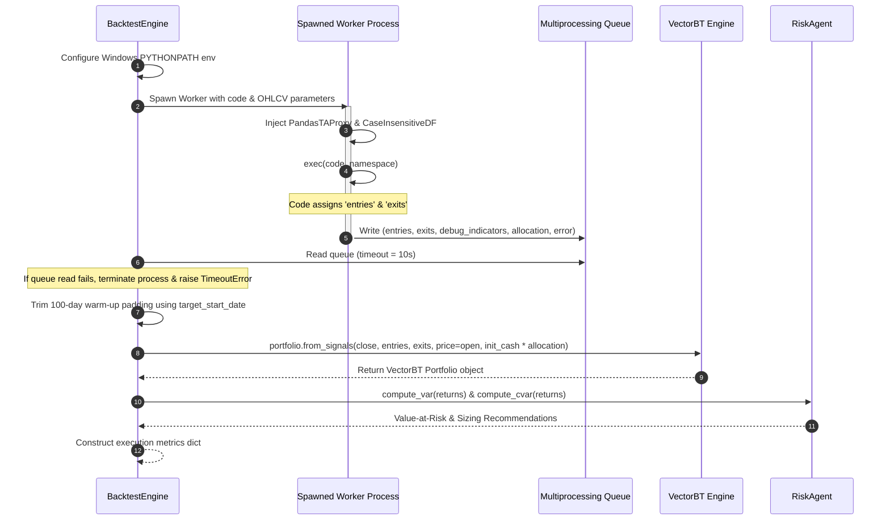

# Module 4: Execution & Portfolio Engine ("The Engine")

The `execution_engine.py` module handles execution safety and backtesting within the agent. It runs LLM-generated code inside a sandboxed environment, calculates risk metrics, normalizes indicator schemas, and executes backtests using the VectorBT framework.

---

## 1. Low-Level Design (LLD)

### Execution Safety & Sandboxing
Evaluating dynamic code using Python's `exec()` can pose security risks or cause infinite loops. To prevent this, the engine runs code within isolated child processes:



### Key Design Pillars
1. **Isolated Worker Sandboxing**: Runs generated scripts in a separate process (`multiprocessing.Process` with a `"spawn"` start method) and enforces a strict 10-second timeout. This prevents infinite loops or resource leaks in the generated code from crashing the main process.
2. **Casing Tolerance & Proxy Wrappers**: Financial libraries use different casing styles for data columns (e.g. `Volume` vs `volume`). The engine uses custom class wrappers to intercept column lookups, ensuring compatibility with the generated code.
3. **Risk-Adjusted Sizing**: Integrates a `RiskAgent` directly into the backtesting flow to evaluate the tail risk of the strategy's return profile and adjust capital allocation recommendations accordingly.

---

## 2. Component and Class Breakdown

### Interface Proxy Wrappers

```
┌────────────────────────────────────────────────────────┐
│                   execution_engine.py                  │
├───────────────────┬───────────────────┬────────────────┤
│ CaseInsensitiveDF │   PandasTAProxy   │   RiskAgent    │
├───────────────────┼───────────────────┼────────────────┤
│ Tolerant pandas   │ Normalizes library│ Computes VaR,  │
│ DataFrame wrapper │ column outputs    │ CVaR & leverage│
└───────────────────┴───────────────────┴────────────────┘
```

#### `CaseInsensitiveDF(pd.DataFrame)`
* **Role**: A pandas DataFrame subclass that supports case-insensitive column lookups.
* **Why it is used**: Automatically handles cases where the generated code queries the wrong column casing (e.g. accessing `df['MACD_12_26_9']` instead of `df['macd_12_26_9']`).
* **Lookup Logic**:
  1. Checks for an exact column match.
  2. If not found, converts the key to lowercase.
  3. If still not found, runs a fuzzy search across columns, ignoring casing and underscores.

#### `PandasTAProxy`
* **Role**: A proxy wrapper around the `pandas_ta` technical indicator library.
* **Why it is used**: Intercepts indicator function calls (e.g., `sma`, `rsi`, `macd`) and normalizes all DataFrame columns in the output to lowercase. It wraps returned DataFrames in a `CaseInsensitiveDF` to prevent key lookup errors.

---

### Risk Management

#### `RiskAgent`
* **Role**: Computes risk metrics from the strategy's return vector.
* **Methods**:
  - `compute_var(returns: pd.Series, confidence: float) -> float`: Computes the historical Value-at-Risk (VaR) at the specified confidence level (default: 95%).
    $$\text{VaR} = \text{Percentile}(\text{returns}, (1 - \text{confidence}) \times 100)$$
  - `compute_cvar(returns: pd.Series, confidence: float) -> float`: Computes the Conditional Value-at-Risk (CVaR / Expected Shortfall). It calculates the average return of the worst-performing days that fall below the VaR threshold.
  - `position_constraint(var: float, max_acceptable_var: float) -> dict`: Evaluates the calculated VaR against a maximum acceptable limit (default: -2.0% daily).
    - If the strategy's VaR is within limits, it approves the strategy at 1.0x leverage.
    - If the VaR exceeds the limit, it recommends scaling down the capital allocation using a leverage factor:
      $$\text{Leverage Factor} = \frac{\text{Maximum Acceptable VaR}}{\text{Strategy VaR}}$$

---

### Backtest Processing

#### `BacktestEngine`
* **Role**: Prepares the data environment, runs the isolated worker process, and executes backtests.
* **Attributes**:
  - `init_cash` (float): The starting portfolio equity.
  - `cost_agent` / `risk_agent`: Hook references.
* **Methods**:
  - `_exec_with_timeout(...)`:
    1. Sets the `PYTHONPATH` environment variable to match the project root so child processes can resolve local imports.
    2. Spawns `_multiprocess_worker` to execute the code in an isolated process.
    3. Blocks on the multiprocessing queue. If execution exceeds the timeout threshold, it terminates the process and raises a `TimeoutError`.
    4. Unpacks and returns `entries`, `exits`, `debug_indicators`, and the `allocation` factor.
  - `execute_strategy_code(code: str, price_data: dict) -> dict`:
    1. Standardizes, cleans, and realigns pricing variables (`close_prices`, `open_prices`, `high_prices`, `low_prices`) and the volume vector to guarantee strict timeline alignment and numeric types.
    2. Passes the code, aligned series, and the current `ticker` context to `_exec_with_timeout`.
    3. Aligns the returned entry and exit signal indices.
    4. Forces a terminal exit signal on the last day (`exits.iloc[-1] = True`) to safely flush open positions and prevent VectorBT/Numba compilation hangs.
    5. Trims the 100-day warm-up padding using the `target_start_date` metadata.
    6. Executes the backtest using VectorBT's signal execution engine, scaling starting cash by the dynamic allocation factor:
       ```python
        portfolio = vbt.Portfolio.from_signals(
            close_prices,
            entries=entries,
            exits=exits,
            price=open_prices,  # Executes trades at the Open of T+1
            freq="1D",
            init_cash=self.init_cash * allocation,
            fees=0.0,
            slippage=0.0,
            upon_long_conflict='ignore',
            upon_short_conflict='ignore',
            upon_dir_conflict='ignore'
        )
       ```
    7. Formulates the final results dictionary, containing the portfolio object, win rate, trading metrics, and risk constraints.

---

## 3. Design Decisions & Trade-offs (The "Why")

### Why execute code in a separate process instead of a separate thread?
Python's Global Interpreter Lock (GIL) limits execution to a single thread at a time. If generated code contains an infinite loop (e.g., `while True:` or an unincremented counter), executing it in a child thread would block the entire application. 
By running code in a separate process spawned via `multiprocessing.Process`, the engine can terminate the child process if it hangs without affecting the main application.

### Why use `upon_long_conflict='ignore'` inside VectorBT?
The code generator is designed to output independent buy and sell signals. In a live portfolio:
- A trader should ignore subsequent buy signals if they are already in a long position.
- If a buy signal and a sell signal occur on the same bar, the trade is ignored to prevent same-bar execution conflicts.
VectorBT handles these rules natively when configured with:
- `upon_long_conflict='ignore'`: Ignores new entry signals when in a position.
- `upon_short_conflict='ignore'`: Ignores new exit signals when not in a position.
- `upon_dir_conflict='ignore'`: Ignores conflicting signals on the same bar.
This allows the code generator to focus on signal logic, leaving portfolio state tracking to the execution engine.
