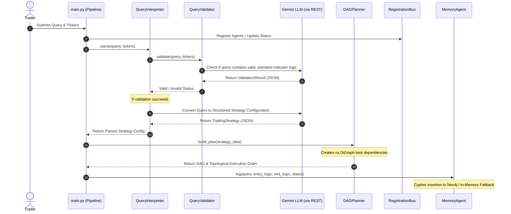

# Module 1: NLP & Orchestration Layer ("The Brain")

The `nlp_orchestration.py` module is the primary orchestrator and parser of the Backtesting Agent. It is responsible for processing the trader's natural language input, validating the parameters and indicators, translating it into a structured trading strategy schema, constructing a Directed Acyclic Graph (DAG) for stage execution, managing agent states, and persisting execution traces.

---

## 1. Low-Level Design (LLD)

### Interaction and Data Flow
The module represents the entry gate of the system. Below is a diagram showing how data flows through this layer:



### Key Design Pillars
1. **Schema Integrity**: Uses `Pydantic` validation to guarantee that unstructured outputs from the language model are forced into typed, predictable structures before entering the downstream strategy parser and compiler.
2. **Execution Ordering**: Uses graph theory (`networkx`) to plan concurrent/sequential tasks. This allows the system to scale (e.g., executing multiple data fetches in parallel before running backtests).
3. **Resilience & Fallbacks**: The Gemini REST client is built directly on Python's standard `urllib` to minimize dependency bloat and uses a retry mechanism with exponential backoff to handle rate limits. The `MemoryAgent` uses a dual-backend model (Neo4j for graphs, fallback in-memory list if connection fails).

---

## 2. Component and Class Breakdown

### Global Utilities and Helpers

#### `print(*args, sep=" ", end="\n", file=None, flush=False)`
* **Description**: A wrapper for standard output. Windows command prompts and PowerShell environments frequently throw `UnicodeEncodeError` when trying to print complex Unicode character glyphs (e.g., emoji icons like 🤖, ⚡). This function catches encoding exceptions, identifies the target stream encoding, and encodes the text using the `"replace"` fallback option.
* **Why it is used**: Protects the command-line interface from crashing during execution telemetry logs due to platform-specific terminal limitations.

#### `stream_chat_completion(...)`
* **Signature**:
  ```python
  def stream_chat_completion(
      client=None, model=None, messages=None, temperature=1.0, 
      top_p=1.0, max_tokens=16384, response_format=None, 
      response_schema=None, print_stream=True
  ) -> str
  ```
* **Parameters**:
  - `messages`: A list of messages in standard chat completion formats (role: `system`, `user`, `assistant`).
  - `response_schema`: A Pydantic subclass or raw JSON Schema to enforce structured outputs.
  - `temperature` / `top_p` / `max_tokens`: Generation parameters.
* **Workflow**:
  1. Formulates a REST payload structured for the Google Gemini Developer API.
  2. Converts Pydantic schemas into raw JSON schema constraints via `_get_schema()`.
  3. Establishes a `urllib.request.Request` to the API endpoint with raw JSON and authentication headers.
  4. Implements an retry loop (up to 5 attempts) starting at a 2-second delay and multiplying by 2 (exponential backoff) specifically for HTTP errors `429` (Rate Limited) and `503` (Service Unavailable).
  5. Safely extracts response candidates via `_safe_extract_text()` to catch safety blocks or empty payloads.
  6. Returns the raw, cleaned string output.

#### `_safe_extract_text(res_json: dict) -> str`
* **Description**: Safely parses the raw JSON dictionary returned by Gemini.
* **Edge Cases Handled**:
  - Checks if the prompt was flagged and blocked by checking `'promptFeedback'`.
  - Validates that `'candidates'` contains items.
  - Inspects `'finishReason'` for `'SAFETY'` blocks, raising a detailed descriptive exception instead of failing with a silent `KeyError` or returning empty strings.

---

### Class Mappings

```
┌────────────────────────────────────────────────────────────────────────┐
│                          nlp_orchestration.py                          │
├───────────────────┬──────────────────┬─────────────────┬───────────────┤
│  QueryValidator   │ QueryInterpreter │   DAGPlanner    │  MemoryAgent  │
├───────────────────┼──────────────────┼─────────────────┼───────────────┤
│ Validates indicator│ Parses text into │ Schedules tasks │ Logs traces   │
│ logic & tickers   │ structured models│ using networkx  │ to Neo4j/RAM  │
└───────────────────┴──────────────────┴─────────────────┴───────────────┘
```

#### `QueryValidator`
* **Role**: The gatekeeper. Prevents invalid user input, fake indicator hallucinations, and empty requests.
* **Methods**:
  - `validate(query: str, tickers: str) -> dict`: Evaluates the query. If the strategy contains non-standard indicators (e.g. *"Buy on Lunar Phase crossover"*), it flags it.
  - **Structured Schema**: Enforces output conformance to `ValidationResult` (contains boolean `is_valid` and string `error_message`).

#### `QueryInterpreter`
* **Role**: Translates natural language strategies into structured python parameters.
* **Methods**:
  - `parse(query: str, tickers: str) -> dict`: Orchestrates `QueryValidator` checks first. If valid, requests Gemini to extract the parameters into the `TradingStrategyWithConfidence` schema.
  - **Structured Schema**: Conforms to `TradingStrategyWithConfidence`:
    - `reasoning` (str): Step-by-step logic breakdown (Chain of Thought).
    - `linguistic_confidence` (float): Self-assigned clarity score between 0.0 and 1.0.
    - `numerical_completeness` (float): Self-assigned indicator parameter completeness score between 0.0 and 1.0.
    - `entry_logic` (str): Plain indicator-based entry signals.
    - `exit_logic` (str): Plain indicator-based exit signals.
    - `duration` (str): Standard yfinance duration format (e.g. "1y", "2y").
    - `tickers` (list[str]): Sanitized and capitalized symbols (or index macros like `["nifty50"]` for entire index strategies).
    - `capital_allocation` (str): Details on how capital should be split among the tickers (e.g., '50% RELIANCE, 50% TCS'). Defaults to '100% per ticker'.
  - **Index Recognition Policy**: If the trader requests to run a strategy on an entire index (e.g., "Nifty 50"), the interpreter intercepts this and populates the `tickers` array with the index macro symbol (`["nifty50"]`) rather than attempting to expand the list of constituent tickers at the LLM reasoning level.
  - **Early-Exit Gate**: Calculates an intent score: `(0.4 * linguistic_confidence) + (0.6 * numerical_completeness)`. If it is less than `0.70`, it returns `"REJECTED"` and halts execution.

#### `DAGPlanner`
* **Role**: Orchestrates pipeline task sequencing.
* **Attributes**:
  - `graph`: A Directed Acyclic Graph instance (`networkx.DiGraph`).
* **Methods**:
  - `build_plan(strategy_data: dict) -> nx.DiGraph`: Constructs nodes and edges.
    - Node `Parse_Intent` acts as the root.
    - Concurrent nodes `Fetch_Data_<Ticker>` are added for each symbol, branching from `Parse_Intent`.
    - Node `Generate_Strategy_Code` is added from `Parse_Intent`.
    - Node `Run_Backtest` is dependent on **all** data fetch tasks and code generation completion.
    - Node `Risk_Analysis` is added from `Run_Backtest`.
    - Node `Generate_Report` is added, dependent on both `Run_Backtest` and `Risk_Analysis`.
  - `get_execution_order() -> list`: Performs a topological sort on the graph using `networkx.topological_sort` to determine a valid linear execution order.
  - `update_node_status(node_name: str, status: str)`: Updates node metadata dynamically.

#### `RegistrationBus`
* **Role**: Dynamic agent directory. Tracks state and heartbeats of execution actors.
* **Methods**:
  - `register(name: str, agent_type: str, status: str)`: Tracks metadata like registered type, status, and last heartbeat timestamps.
  - `update_status(name: str, new_status: str)`: Updates active agent status (e.g., "Working", "Idle").
  - `get_available(agent_type: str) -> str | None`: Retrieves the name of an idle agent matching a specific type.

#### `MemoryAgent`
* **Role**: Graph trace storage agent.
* **Attributes**:
  - `active` (bool): Verification flag. True if Neo4j is online.
  - `driver`: Neo4j driver connection client.
* **Methods**:
  - `log(query: str, entry: str, exit_logic: str, status: str)`: Executes Cypher queries to merge `UserQuery` and `Strategy` nodes, writing execution edges (`TRANSLATED_TO`, `EXECUTED_AS`).
  - **In-Memory Fallback**: If the driver fails to establish a connection to Neo4j, the class logs to a private local list (`self._traces`) and prints `[SIM] Trace logged in memory` without throwing exceptions.

---

## 3. Design Decisions & Trade-offs (The "Why")

### Why `urllib` instead of external HTTP libraries (like `requests`)?
Writing REST requests via native standard libraries ensures zero-dependency execution. In sandboxed backtesting systems, minimizing external package reliance reduces installation complications and security risks.

### Why `networkx` for Orchestration?
Quantitative pipelines require clear scheduling. When executing strategies across multiple tickers, the system needs to fetch data in parallel. Using a graph-based planner (`networkx`) allows us to easily:
1. Visualize the execution path as a DAG.
2. Resolve scheduling dynamically via topological sorting.
3. Scale easily to multi-threaded or multi-process execution models where nodes with zero shared dependencies are executed concurrently.

### Why Pydantic Schema Enforced Output?
Generative models are historically prone to unstructured text drift (e.g. including conversation fillers, wrapping code blocks in markdown without request, changing JSON keys). By feeding the JSON schema of a Pydantic model directly into the Gemini API (via `responseSchema` configuration), the model forces the LLM's output grammar to strictly match the requested JSON properties, ensuring the parsed result fits our pipeline constraints.
