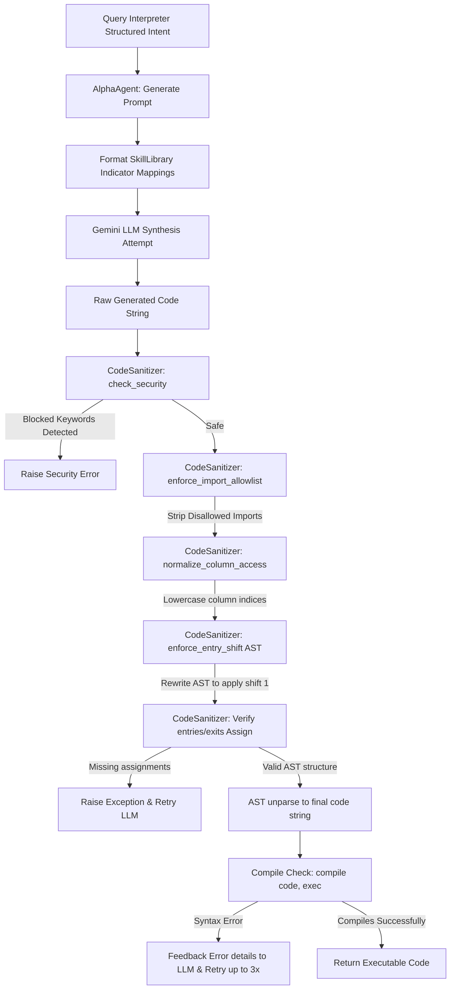

# Module 2: Strategy Synthesis & Skill Library ("The Translator")

The `strategy_synthesis.py` module acts as the compiler and code generator of the Backtesting Agent. It is responsible for translating the structured strategy configuration (received from "The Brain") into executable Python code that matches VectorBT's execution semantics.

---

## 1. Low-Level Design (LLD)

### Code Generation & Sanitization Flow
The module receives parsed intent parameters and synthesizes Python statements inside a secure compiler environment. Below is the system flow showing how code is generated, checked, and modified:



### Key Design Pillars
1. **Abstract Syntax Tree (AST) Modification**: Rather than relying on fragile string replacement or regex patterns to adjust code (which can easily break due to indentation or whitespace changes), this module uses Python's standard `ast` compiler module. It parses code into tree nodes, traverses them, modifies specific operations directly at the syntax tree level, and rebuilds the code.
2. **Deterministic Safety Guard**: Standard LLMs cannot be trusted to avoid security vulnerabilities or lookahead bias. The sanitization layer isolates and modifies variables automatically, removing the security burden from the generative model.
3. **Iterative Self-Healing Loop**: Programmatic code generation is prone to small compiler syntax errors (like missing parentheses or mismatching variable shapes). The synthesis layer implements a self-correction loop that parses compiler tracebacks and submits them back to the LLM to resolve syntax issues automatically.

---

## 2. Component and Class Breakdown

### Skill Library

```
┌────────────────────────────────────────────────────────┐
│                  strategy_synthesis.py                 │
├───────────────────┬───────────────────┬────────────────┤
│   SkillLibrary    │ EntryExitShifter  │ CodeSanitizer  │
├───────────────────┼───────────────────┼────────────────┤
│ Standardizes indicator│ AST transformer │ Sanitizes, checks│
│ code templates    │ adding shift(1)   │ security/imports│
└───────────────────┴───────────────────┴────────────────┘
```

#### `SkillLibrary`
* **Role**: A registry that houses code snippets for common technical indicators using `pandas_ta` or `talib` syntax.
* **Predefined Indicator Mappings**:
  - `RSI` (Relative Strength Index): `pandas_ta.rsi(close_prices, length={window})`
  - `SMA` (Simple Moving Average): `pandas_ta.sma(close_prices, length={window})`
  - `EMA` (Exponential Moving Average): `pandas_ta.ema(close_prices, length={window})`
  - `MACD` (Moving Average Convergence Divergence): `pandas_ta.macd(close_prices, fast=12, slow=26, signal=9)`
  - `BBANDS` (Bollinger Bands): `pandas_ta.bbands(close_prices, length=20, std=2)`
  - `STOCH` (Stochastic Oscillator): `pandas_ta.stoch(high, low, close)`
  - `ATR` (Average True Range): `pandas_ta.atr(high, low, close, length=14)`
* **Methods**:
  - `get_available_skills() -> dict`: Returns the static indicators dictionary.
  - `format_skill_context() -> str`: Formats indicators into a readable context block injected into the system prompt to guide the LLM's API calls.

---

### Sanitization and AST Manipulation

#### `EntryExitShifter(ast.NodeTransformer)`
* **Role**: A custom Abstract Syntax Tree node transformer that traverses assigned variables in the AST.
* **Why it inherits from `ast.NodeTransformer`**: It allows targeted modification of syntax tree nodes. By overriding `visit_Assign`, it checks the target variable names.
* **AST Transformation Details**:
  - If a variable named `entries` or `exits` is assigned, the node value is wrapped:
    - **Original**: `entries = close_prices > sma`
    - **Transformed AST Equivalent**: `entries = (close_prices > sma).shift(1).fillna(False)`
  - Replaces the original value node with a new `ast.Call` representing the `.shift(1)` method call and another `ast.Call` representing `.fillna(False)` on top of the shifted series.

#### `CodeSanitizer`
* **Role**: Orchestrates the sanitization pipeline and enforces runtime safety constraints.
* **Static Attributes**:
  - `ALLOWED_IMPORTS = {"pandas_ta"}`: Strict import whitelist.
* **Static Methods**:
  - `enforce_entry_shift(code_string: str) -> str`: Parses the code into an AST tree, applies the `EntryExitShifter` transformer, and converts the modified tree back to text via `ast.unparse()`. If AST parsing fails, it falls back to a regex-based replacement.
  - `check_security(code_string: str) -> None`: Scans code for blocked keywords (`os`, `sys`, `eval`, `open`, `__import__`) using regex word boundary searches (`\b`) to prevent false positives on valid terms like `openalgo` or `open_prices`.
  - `enforce_import_allowlist(code_string: str) -> str`: Strips any `import` or `from ... import ...` statements unless they match the whitelist (`pandas_ta`), preventing generated code from importing system utilities.
  - `normalize_column_access(code_string: str) -> str`: Searches for indicator columns accessed with single/double quotes (e.g. `df['MACD_12_26_9']`) and normalizes the column name to lowercase (e.g. `df['macd_12_26_9']`) to match `pandas_ta` conventions.
  - `validate_indicators(code_string: str) -> tuple[bool, str]`: Checks if the code contains calls to indicators.
  - `calculate_code_confidence(code_string: str) -> float`: Evaluates structural risk metrics of the generated code (e.g. checks lookahead bias risk, positional indexing `.iloc` density, masked errors via try/except, and magic number assignments). Returns a score between 0.0 and 1.0.
  - `sanitize(code_string: str) -> str`: Runs the complete validation pipeline. It checks security, strips unauthorized imports, normalizes indicator casing, wraps assignments via `EntryExitShifter`, checks for explicit declarations of `entries` and `exits`, and finally compiles the code using Python's native `compile()` function to check syntax before execution.
 
---
 
### Code Synthesis
 
#### `AlphaAgent`
* **Role**: Converts natural language intent into a script by generating and sanitizing the code.
* **Attributes**:
  - `MAX_RETRIES = 3`: Maximum compilation/confidence check retry attempts.
* **Methods**:
  - `generate_strategy_code(parsed_intent: dict) -> tuple[str, float]`: Orchestrates the code generation and structural checks.
    - **Workflow**:
      1. Renders the custom instruction prompt, injecting the indicator instructions from `SkillLibrary`.
      2. Calls `stream_chat_completion` to generate Python code.
      3. Passes the result to `CodeSanitizer.sanitize()`.
      4. If code compiles, runs `CodeSanitizer.calculate_code_confidence()` to grade its structure.
      5. If a `SyntaxError` or low structural confidence (`score < 0.70`) is encountered, it captures the error/issue details, appends feedback to the prompt, and retries LLM generation (up to 3 times).
      6. Returns a tuple: `(working_code_string, structural_confidence_score)`.

---

## 3. Design Decisions & Trade-offs (The "Why")

### Why automatic shifting via AST instead of prompt instructions?
Generative LLMs are prone to occasional mistakes, especially with complex vector operations. Even when explicitly instructed to use `.shift(1)` to avoid lookahead bias, LLMs frequently omit it, apply it to indicators instead of signal vectors, or apply it multiple times. 
By compiling the code into an AST and using `EntryExitShifter` to automatically append `.shift(1).fillna(False)` to `entries` and `exits`, the lookahead-bias guard becomes a guaranteed structural constraint.

### Why block math operations on risk targets in synthesized code?
The `AlphaAgent` prompt contains a rule: *"Never write mathematical expressions checking stop_loss or take_profit conditions. If the strategy mentions risk targets or stop losses, do NOT append them to the 'exits' boolean series."*
**Reasoning**:
VectorBT calculates risk targets (like trailing stop losses, take profits, or stop losses) dynamically via its internal trade execution loops. Implementing these constraints using manual pandas boolean operations inside the generated code is slow, prone to errors, and introduces lookahead bias. Keeping the synthesized signals limited to indicator logic allows the execution engine to handle risk constraints natively.
